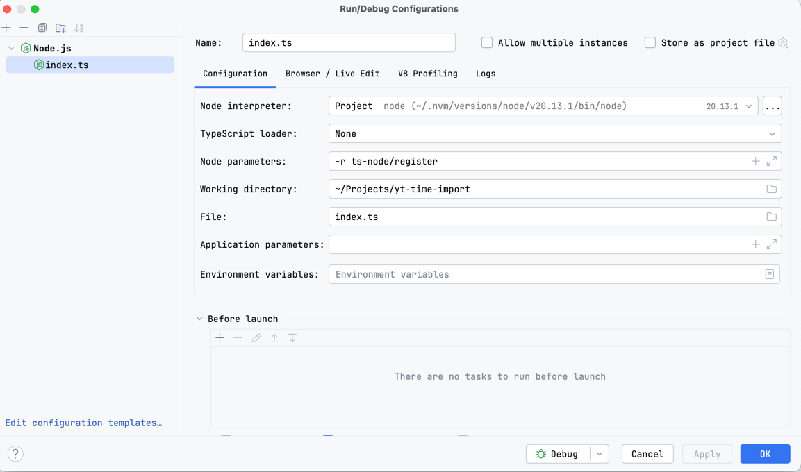

# Назначение

Этот скрипт обрабатывает CSV-файлы содержащие информацию о затраченном времени и заносит информацию в YouTrack через [REST API YouTrack](https://www.jetbrains.com/help/youtrack/devportal/youtrack-rest-api.html).

## Требования к CSV

CSV-файл должен удовлетворять следующим требованиям:
- Первая строка должна содержать названия колонок.
- Обязательные колонки:
    - `Description` — описание задачи с ключом задачи в начале (например, "TASK-1234: Описание задачи").
    - `Start date` — дата создания записи в формате `yyyy-mm-dd`.
    - `Duration` — затраченное время в формате `hh:mm:ss`.

Пример файла:
```
Description, Start date, Duration
TASK-1234: Описание задачи, 2025-04-01, 01:30:00
TASK-5678: Другая задача, 2025-04-02, 02:00:00
```
Файл должен быть расположен в папке `reports`. Для обработки будет выбран последний добавленный файл.

## Использование

### Шаг 1: Настройка окружения

1. Установите зависимости:
```
yarn install
```
2. Скопируйте файл `.env.example` в файл `.env`:
```
cp .env.example .env
```
3. Откройте `.env` и заполните корректные значения для переменных окружения. Чтобы получить значение для `AUTH_TOKEN` нужно перейти в свой профиль, на вкладку [Account Security](https://equalize.youtrack.cloud/users/me?tab=account-security). В разделе `Permanent Tokens` можно создать новый или использовать существующий токен.

### Шаг 2: Запуск скрипта

#### Вариант 1: Запуск из терминала

Для запуска скрипта из терминала, выполните команду:
```
ts-node src/index.ts
```


#### Вариант 2: Запуск с помощью конфигурации в PHPStorm


1. Откройте PHPStorm.
2. Перейдите в меню `Run` → `Edit Configurations...`.
3. Создайте новую конфигурацию для запуска скрипта:
    - Выберите тип конфигурации `Node.js`.
    - Укажите Node parametes: `-r ts-node/register`
    - Укажите путь к файлу скрипта, `index.ts`.
4. Нажмите `OK` для сохранения конфигурации.
5. Теперь вы можете запустить скрипт, используя PHPStorm. При таком подходе также доступен режим отладки.

